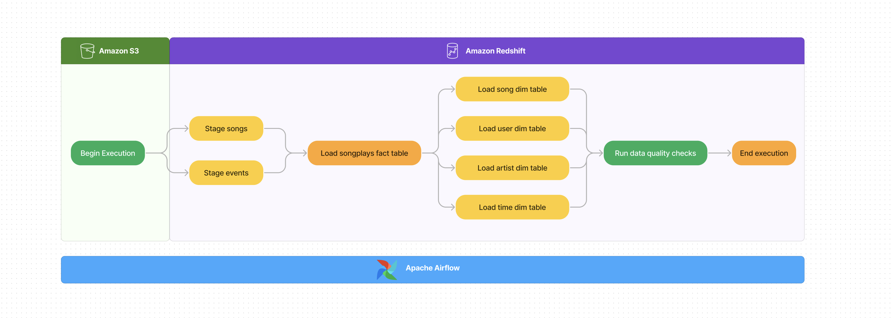
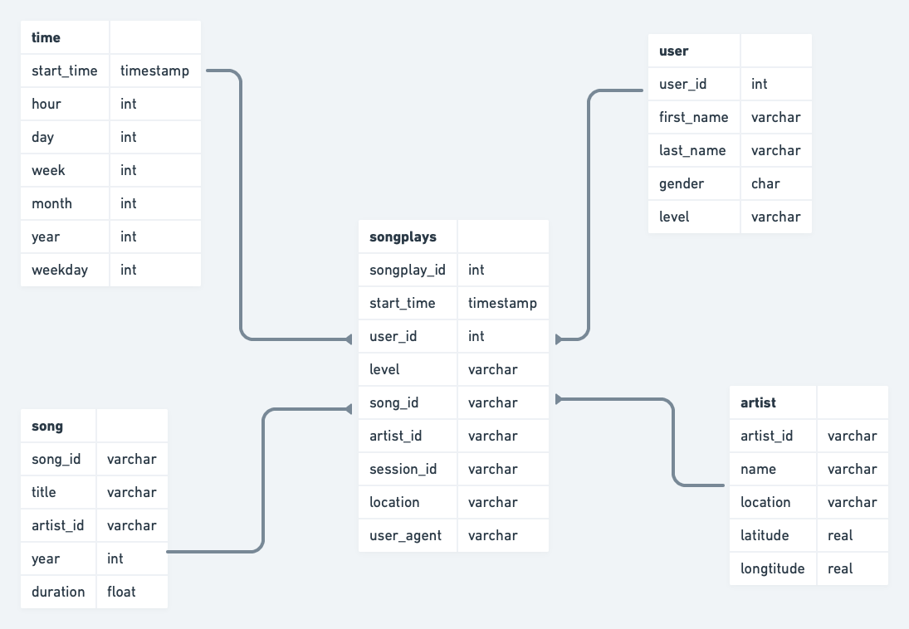

# ETL_AWS_Airflow
Use Airflow to automate data warehouse ETL pipelines for a music streaming company.

The source data resides in S3 and needs to be processed in  data warehouse in Amazon Redshift. The source datasets consist of JSON logs that tell about user activity in the application and JSON metadata about the songs the users listen to.

The overall workflow is as follows:

Fact & Dimension table:
